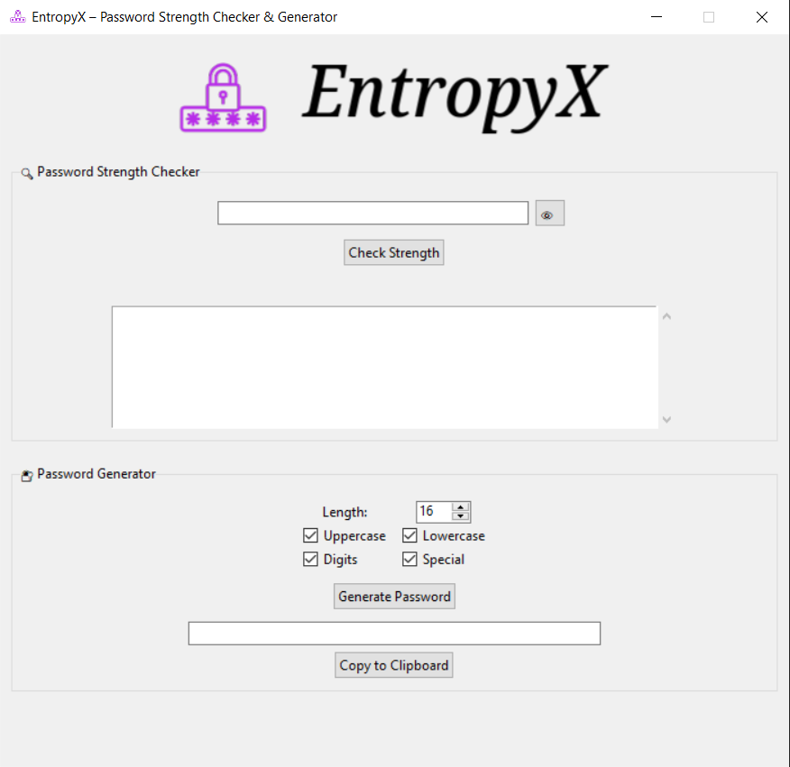

EntropyX is a powerful desktop tool to evaluate password strength and generate secure passwords using smart entropy-based logic. It's lightweight, user-friendly, and perfect for anyone serious about digital security.


## Features

* Check Password Strength: Get detailed, color-coded feedback.
* Generate Secure Passwords: With customizable character sets.
* Show/Hide Toggle: View passwords in real time.
* Copy to Clipboard: One-click copy feature.
* Brand Your App: Easily customize the logo.
* Unit + Integration Tested: Confident, maintainable code.


## Folder Structure

```
EntropyX/
├── frontend/
│   └── app.py             # GUI built with Tkinter
├── backend/
│   ├── evaluator.py       # PasswordEvaluator class
│   └── generator.py       # PasswordGenerator class
├── assets/
│   └── logo.png           # Custom logo
├── tests/                 
│   ├── test_evaluator.py  # Unit and integration tests
│   ├── test_generator.py
│   └── test_integration.py    
├── main.py
├── requirements.txt
└── README.md
```


## Installation

```bash
git clone https://github.com/yashgulatii/EntropyX.git
cd EntropyX
pip install -r requirements.txt
python -m nltk.downloader words
```

## Running the App

```bash
python main.py
```


## Running Tests

```bash
python -m unittest discover tests/
```

Or if you use pytest:

```bash
pytest tests/
```


## Want to Contribute?

Here are a few cool ideas that would make great contributions:

* Integrate HaveIBeenPwned API
  Check if passwords are already breached.

* Password Reuse Detection
  Warn users if they’ve used the same password before.

* Command-Line Interface (CLI)
  Add support for terminal-only password generation/evaluation.

* Export to Vault or CSV
  Allow optional export of passwords to local encrypted storage.

* Multi-language Support
  Add language toggles for broader accessibility.

* Theming Engine
  Let users switch between dark, light, or custom color schemes.

Want to help? Fork the repo, make your changes, and submit a PR!


## Screenshot




## License

MIT License – do whatever you want with it. Just don't ship it as malware.

